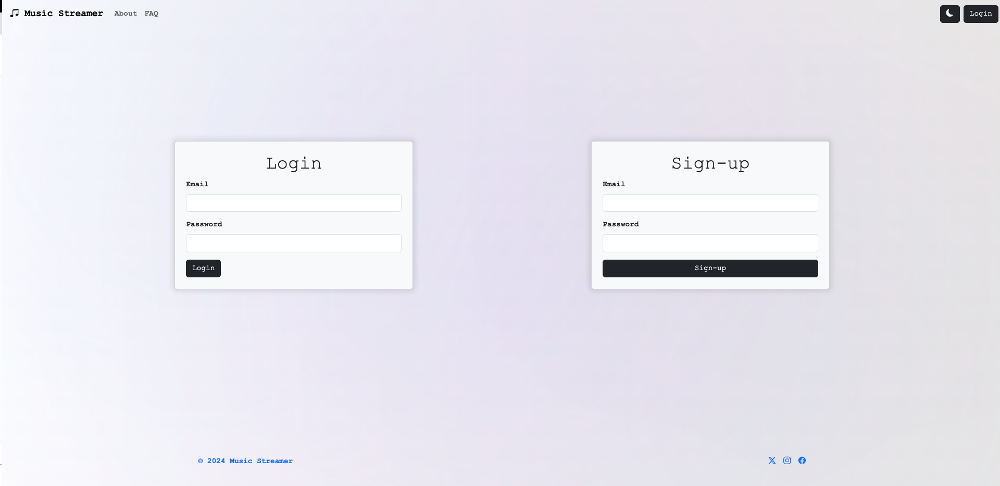

 

# SVG Generator

The Web Music Streaming App is a platform designed for music enthusiasts to enjoy their favorite tunes seamlessly. With a user-friendly interface and a wide selection of songs, it offers an immersive music streaming experience. Powered by Handlebars, Node.js, PostgreSQL, Plyr, Express, and Sequelize, this app ensures smooth performance and reliability.

## Table of Contents
- [Features](#features)
- [Technologies used](#technologies)
- [Usage](#usage)
- [Visuals](#visuals)
- [License](#license)
- [Contributing](#contributing)
- [Tests](#tests)
- [Questions](#questions)

## Features

### 1. Song List Display
- The application displays a comprehensive list of songs.
- Users can scroll through the list to view all available songs.

### 2. Music Streaming
- Users can click on a song to start streaming it instantly.
- The application plays the selected song with high-quality audio.

### 3. Playlist Creation
- Users have the ability to create personalized playlists.
- They can add their favorite songs to the playlist.
- Playlists allow users to group their favorite songs together for easy access.
- Users can view and play songs directly from their playlists.

### 4. Theme
- Easy toggle between dark and light themes.

## Technologies used

- Handlebars
- Node.js
- PostgreSQL
- Plyr
- JavaScript
- Express
- Sequelize
- YouTube Data Api
- bcrypt

## Usage

To use this web app, follow the link below:

    [add render link]

Follow the prompts to provide information about your project. Once you've completed all the prompts, the README file will be generated in the current directory.

## Visuals

**Video Demo

User interface

## Contributing

Contributions to this application are welcome! 

Follow these steps to contribute:

1. Fork the repository.

2. Create a new branch for your feature or enhancement.
3. Make your changes and commit them, following best practices for commit messages.
4. Push your changes to your forked repository.
5. Submit a pull request with a clear description of your changes.

## License

This project is licensed under the MIT License.

## Acknowledgements

This project was developed and executed by Owen and Jasmine as a part of a class project.
